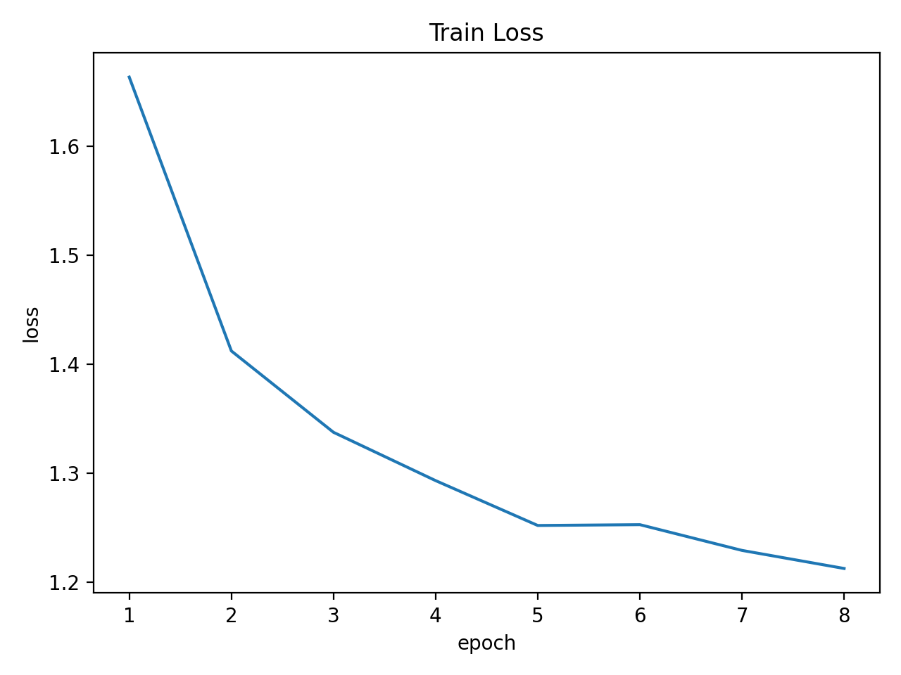
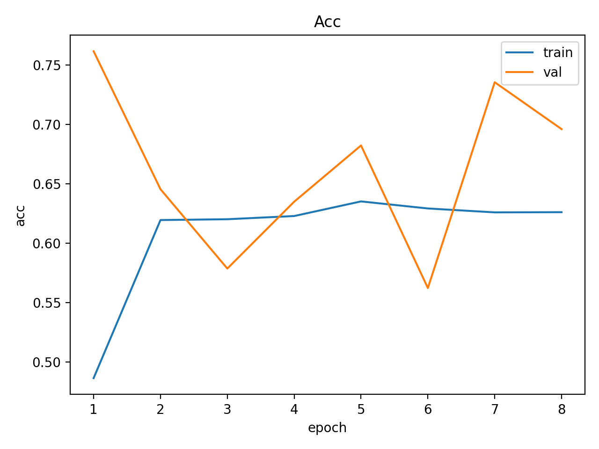
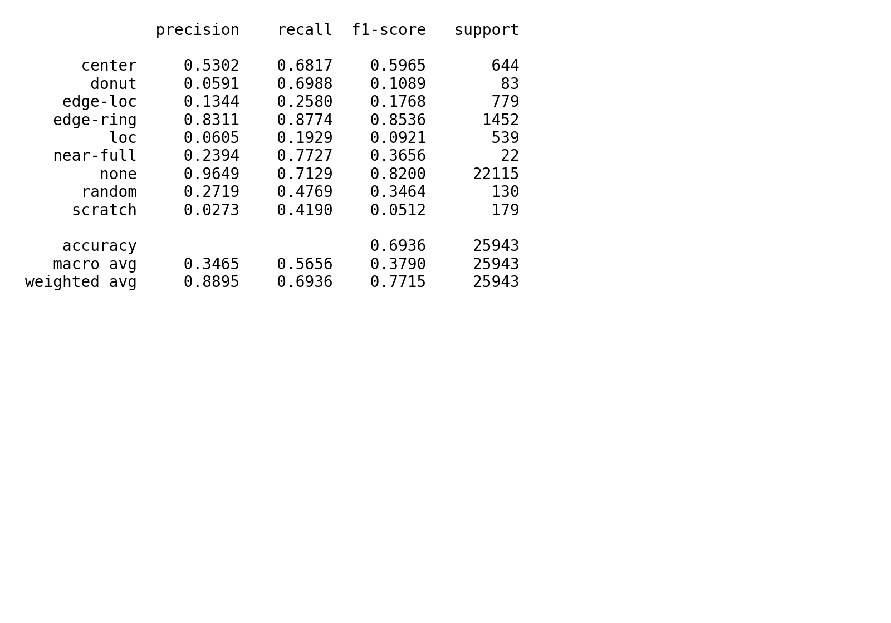
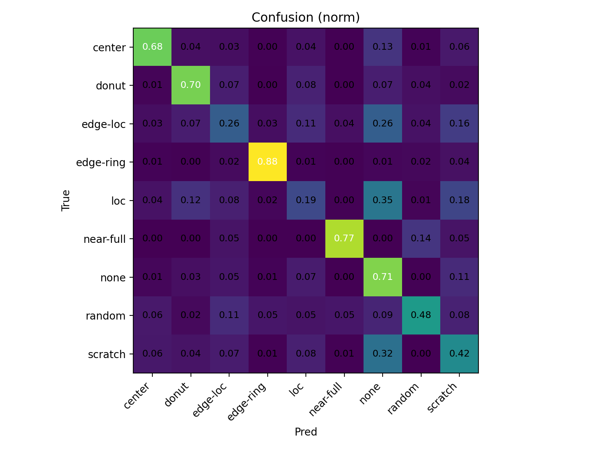
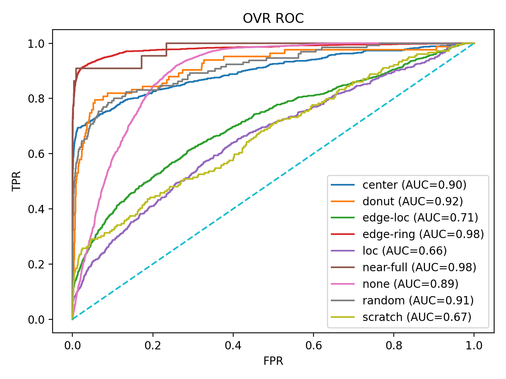
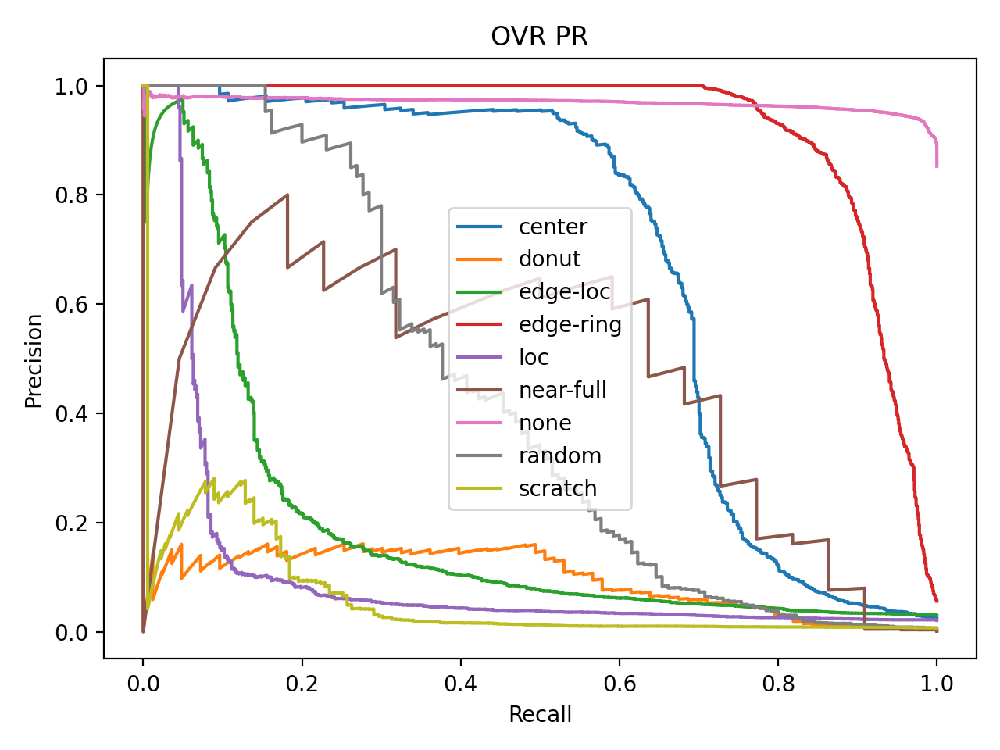

# wafer-defect-classification
Wafer map defect classification using ResNet18 (transfer learning) on WM-811K dataset with interpretability (Grad-CAM).

📊 Results

I trained a ResNet18 (ImageNet pretrained) model on the WM-811K Wafer Map Dataset (172,950 labeled wafers across 9 defect classes).

Training used class-weighted cross-entropy to address imbalance, and results were evaluated on a held-out test set.

🔹 Training Dynamics

Training loss decreases smoothly, with validation accuracy >90% by epoch 8.

Model shows good generalization — no severe overfitting observed.

   

🔹 Classification Report

The classifier performs well overall, with strong metrics for majority classes. Minority classes (e.g., donut, near-full) remain challenging due to dataset imbalance.

See: models/classification_report.txt

  

Micro-F1 (weighted): High, dominated by “none” and “edge-ring” classes

Macro-F1: Lower, reflecting weaker performance on rare defect classes

🔹 Confusion Matrix

Normalized confusion matrix (rows = true class, columns = predicted):

  

Strong diagonal for none, edge-ring, center

Confusions between edge-loc ↔ edge-ring and center ↔ loc — intuitive given visual similarity

Rare classes (e.g., near-full) scatter more

🔹 ROC & Precision–Recall Curves

One-vs-Rest (OVR) evaluation per class:

   

ROC-AUC: >0.9 for major classes

PR curves: reveal the imbalance — minority classes drop precision quickly

🔹 Interpretability via Grad-CAM

Grad-CAM heatmaps confirm the model focuses on true defect regions:

  

For edge-loc: activations cluster along wafer edges

For center defects: attention maps highlight the wafer center

Misclassifications show misleading activations — insights for future improvement

🔹 Key Insights

Strong baseline: ResNet18 pretrained reaches ~93% overall accuracy on WM-811K.

Imbalance challenge: Minority defect classes (donut, near-full) drag down macro-F1.

Interpretability: Grad-CAM validates the model is not a black box — it attends to physical defect zones.

Industry reflection: Detecting rare patterns is hard in fabs; this project mirrors real-world yield-analysis challenges.
